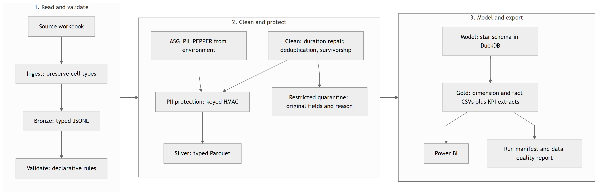

# ASG Airlines

A workbook-to-warehouse batch for the airline assessment. It validates four Excel sheets, repairs flight timing, resolves duplicates, removes unnecessary personal data, and exports a DuckDB model and Power BI-ready CSVs.

The local pipeline exports 14 gold CSVs, including a monthly booking extract. The Power BI report is built and verified in Desktop; see [Power BI verification](powerbi/VERIFICATION.md).

[Local verification record](reports/verification.json).

## Run

Use Python 3.13. Tested dependencies are pinned in `requirements.txt`.

```powershell
python -m venv .venv
.\.venv\Scripts\python -m pip install -r requirements.txt
# Copy the authorized source workbook to data/raw/UseCase_Airlines.xlsx.
# Generate a private key once and retain it securely for subsequent runs.
$env:ASG_PII_PEPPER = .\.venv\Scripts\python -c "import secrets; print(secrets.token_hex(32))"
.\.venv\Scripts\python -m src.pipeline
.\.venv\Scripts\python -m pytest -q
```

The program reads `ASG_PII_PEPPER` from the environment; `.env` is not loaded automatically. It requires at least 32 characters. Reuse the existing private key when available to reproduce passenger tokens. A different key changes those tokens. Counts and financial KPIs are independent of the key.

For a separate input/output location:

```powershell
.\.venv\Scripts\python -m src.pipeline --input "C:\private\UseCase_Airlines.xlsx" --output-dir "C:\private\asg-output"
```

A clean checkout needs the authorized source workbook because raw PII is excluded from Git. The source SHA-256 is `82549a897f4829d3e06cfb21b8b1f9100a10cba268ceb3c4597f71ee558a9db3`.

## Flow and model

```text
Excel -> typed source cells in bronze JSONL -> validation
      -> cleaning and PII protection -> silver Parquet + restricted quarantine
      -> DuckDB dimensions/facts/KPI views -> gold CSVs -> Power BI
```



Flights, bookings and payments have separate grains. Each payment links to one booking; each booking links to one unique flight or the unknown flight member. Date, airline, route, passenger and status dimensions support filtering. The model includes 1,003 real flights plus one unknown placeholder; flight KPIs exclude the placeholder. [Model and grains](docs/data_model.png) · [Execution flow](docs/EXECUTION_FLOW.md).

## Measured findings

- Flights: 1,020 source rows; 15 exact copies removed; both conflicting `6F250` rows quarantined. Its two bookings survive with `flight_sk = -1`.
- SJ192: raw interval -1,140 minutes; corrected interval 300 minutes. Legitimate next-day arrivals are unchanged.
- Passengers: 1,039 rows become 1,000 IDs through explicit survivorship. All source Aadhaar cells already contain twelve-digit text; 114 retain a leading zero.
- Amounts: 922 valid, 48 missing and 30 non-numeric. Unusable amounts remain NULL.
- The naive three-way join inflates payments from INR 7,385,142.98 to INR 7,593,758.92: an overstatement of INR 208,615.94.
- Counts depend on grain: 382 unbooked passenger rows represent 364 IDs. The source has 124 overnight rows after timing repair and before duplicate treatment; the final model has 122.
- Bookings span April 2025 through April 2026: 13 year-month periods totaling 1,000 bookings. April is split into 48 bookings in 2025 and 56 in 2026.

[Independent source profile](reports/profile.md) · [Final quality report](reports/data_quality_report.md) · [Decisions](docs/DECISIONS.md).

## Final KPIs

| Metric | Result |
|---|---:|
| Real flights | 1,003 |
| Average duration | 164.67 minutes |
| Bookings / payment records | 1,000 / 1,000 |
| Gross valid payment amount | INR 7,385,142.98 |
| Confirmed-booking payment amount | INR 2,471,402.04 |
| Cancellation / confirmation rate | 31.4% / 32.0% |
| Payment coverage | 63.7% |
| Average valid payment per paid booking | INR 12,186.70 |
| Overnight flights | 122 / 1,003 = 12.16% |
| Red-eye departures | 271 / 1,003 = 27.02% |
| Source issue events | 714 across 15 issue categories |

Route traffic and airline distribution are exported in `kpi_route.csv` and `kpi_airline.csv`. `kpi_booking_month.csv` groups bookings and their associated valid payments by actual year-month. The average valid payment uses 606 bookings with a valid amount; payment coverage uses 637 bookings with any payment record. [Formulas and denominators](docs/KPI_DEFINITIONS.md). Gross payment includes every booking status; it is not net revenue. The workbook has no scheduled-versus-actual timestamps, so true delay is unavailable.

## Files and review

| Location | Purpose |
|---|---|
| `src/`, `config/`, `sql/` | Pipeline, explicit rules and warehouse SQL |
| `data/raw`, `data/bronze`, `data/quarantine` | Restricted inputs and investigation data; excluded from Git |
| `data/silver` | Typed cleaned local records; excluded from Git |
| `data/gold` | Analytical CSVs and local DuckDB file |
| `reports/` | Profile, quality findings, survivorship and run evidence |
| `tests/` | Business rules, model grains, PII checks and rerun/failure behavior |
| `notebooks/` | Executed evidence walkthrough using the actual modules |
| `docs/` | Word report, diagrams, assumptions, decisions and execution notes |
| `powerbi/` | `.pbip` project, model/page definitions, DAX measures, build guide and verification record |

Gold omits raw names, Aadhaar, emails, phone numbers, DOB, passports and emergency contacts. Passenger HMAC tokens and demographics remain pseudonymous data. `.gitignore` is not access control; see [security boundaries](docs/SECURITY.md).


## Power BI project

`powerbi/ASG_Airlines.pbix` is the built report, backed by the PBIP project in `powerbi/ASG_Airlines.Report` and `powerbi/ASG_Airlines.SemanticModel`. The model holds 12 tables, 26 measures and 8 active single-direction relationships across four pages: Executive Overview, Duration & Schedule, Route & Airline Performance, and Data Quality & Anomalies.

Payments join to bookings and bookings to flights, so payment totals cannot fan out across duplicate flight keys. Queries read the gold CSVs through the `SourceFolder` parameter; set it to your own `data/gold` path before refreshing. Page captures are in `powerbi/screenshots/`. [Build guide](powerbi/BUILD_GUIDE.md) · [Verification](powerbi/VERIFICATION.md).

To execute the notebook/report builders, install `requirements-docs.txt`. Run `python tools/build_notebook.py` after a successful pipeline. The Word report builder is `tools/build_documentation.py`; its diagrams and final report are provided in `docs/`.

[Decisions](docs/DECISIONS.md) · [Power BI verification](powerbi/VERIFICATION.md).
